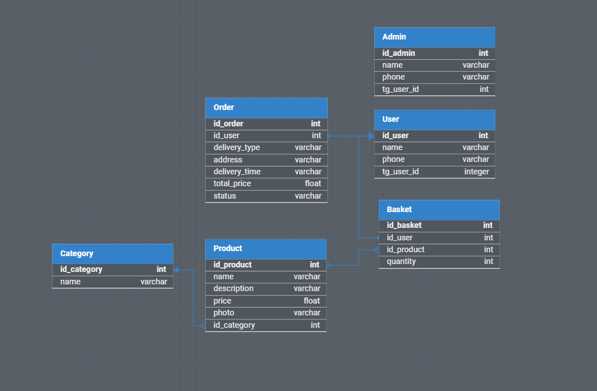

# Телеграм Бот - Онлайн Пекарня

---

### Стек используемый при разработке бота
[](https://www.python.org/downloads/release/python-3100/) [](https://pypi.org/project/aiogram/2.23.1/) [](https://www.sqlalchemy.org/)

---

## Настройка проекта перед запуском
### 🚩 Создание и активация виртуального окружения 🚩

## Windows
```shell
  python -m venv .venv
```

```shell
  .venv/Scripts/activate
```

## Linux
```shell
  python3 -m venv .venv
```

```shell
  source .venv/bin/activate
```

---

## Установка нужных библиотек
```shell
   pip install -r requirements.txt
```

---

## 🚩 Запуск Бота 🚩

- ### Перед запуском создайте файл в корневой папке проекта `.env`
  * Добавьте в файл:
    > API_TOKEN_BOT=`Токен Вашего Бота`
      
    > DATABASE_URL=`sqlite:///./base/CooKingBase.db `
    
    > ADMIN_PASSWORD=`Пароль -> для выдачи пользователям`

    > ADMIN_PHONE_SUPPORT=`Телефон Пекарни -> основной номер телефона пекарни, 
      номер телефона горячей -> ПРИМЕР: 78009999905 `
    

## ⚡ Запустите файл `main.py` ⚡

</br>* <i><b>Windows</b></i> *
```shell
  python main.py
```

</br>* <i><b>Linux</b></i> *
```shell
  python3 main.py
```
---

### Структура Базы Данных


---

[✨ Developer 2024 🎉](https://github.com/Zagidin)